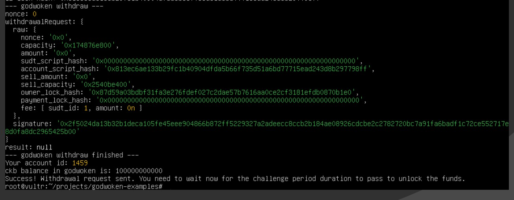

 Task 09
1. A screenshot of the console output immediately after running the withdraw command.

2. The Ethereum address that you've used for your Layer 2 account (in text format).
0xE95117ae8A81f97126718dD0cF018d3946494e56
3. The Nervos Layer 1 address that you passed to withdraw command (in text format).
ckt1qyqg48fmc4j7wvp5fc3jqz2mfu9nt5vvslwq0pv63
